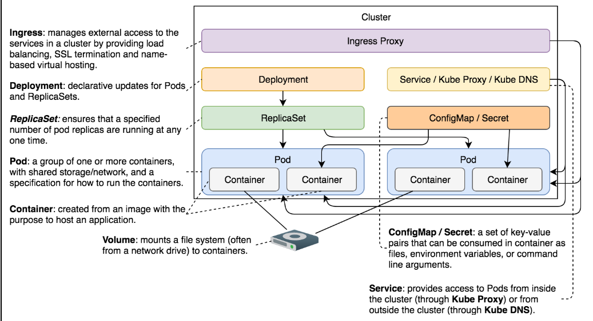

# Kubernetes Notes
 [Course Link](https://www.educative.io/courses/practical-guide-to-kubernetes)

## Content

1. Pods
2. ReplicaSets
3. Services
4. Deployments
5. Ingress
6. Volumes
7. [ConfigMaps](#ConfigMaps)
8. [Secrets](#Secrets)

## ConfigMaps

ConfigMap takes a configuration from a source and mounts it into running containers as a volume.
For setting ConfigMap use this command after creating the cluster:
```
kubectl config current-context
```

ConfigMap takes a config from a source and **mounts** it into running containers as a **volume**.
Configs can be injected from different sources:
- from a file, multiple files or directory:

  ```
    kubectl create cm my-config --from-file=prometheus-conf.yml
  
    kubectl create cm my-config --from-file=prometheus-conf.yml  --from-file=file.yml
  
    kubectl create cm my-config --from-file=directory
  ```
  
  Verify:

  ```
    kubectl exec -it alpine -- ls -l /etc/config
  
    kubectl describe cm my-config```

- from key-value literals:
  ```
    kubectl create cm my-config --from-literal=key=value
  ```

  Verify:

  ```
  kubectl exec -it alpine -- cat /etc/config/key
    ```

 - from env file:

   ```
   kubectl create cm my-config --from-env-file=env.yml
    ```

  With **env.valueFrom.configMapKeyRef** syntax, we need to specify each ConfigMap key separately. 
  That gives us control over the scope and the relation with the names of container variables.
  
  The **envFrom.configMapRef** converts all ConfigMap’s data into environment variables. 
  That is often a better and simpler option.

 - define as YAML:
  ```
  apiVersion: v1
  kind: ConfigMap
  metadata:
    name: prom-conf
  data:
    prometheus.yml: |
      global:
        scrape_interval:     15s
```

The ConfigMap object’s data section has only one key (prometheus.yml). Once this ConfigMap is mounted as a volume, 
the name of the file will be the same as the key (prometheus.yml).

The value has a bit of “special” syntax. Unlike the previous example where the value was a single word written directly 
after the colon, the structure of the value is now a bit more complex. To be more precise, it contains multiple lines.

When working with a large value, we can start with the pipe sign (|). Kubernetes will interpret the value as “everything
 that follows, as long as it is indented.” You’ll notice that all the lines of the value are at least two spaces to the
 right of the beginning of the key (prometheus.yml). If you’d like to insert an additional key, all you’d need to do is 
 to add it on the same level (indentation), as the other prometheus.yml.      
     
**Make sure** configMap IS NOT defined in the same file as the objects that mount it.


## Secrets

Check the secrets in the cluster:

```
kubectl get secrets

kubectl get secret my-creds -o json

```

Kubernetes automatically creates "default-token-.." secret that is used to access the API and modifies the Pods to use this secret.

Secrets can be generic, docker-registry (to provide kubelet with credentials it needs to pull images from private registries)
or tls (for storing certificates).

Secrets are abse64 encoded. To decode:

```
kubectl get secret my-creds \
    -o jsonpath="{.data.username}" \
    | base64 --decode

```

Secrets are almost the same as ConfigMaps. The main difference is that the secret files are created in tmpfs.
Secrets are constructed as in-memory files, thus leaving no trace on the host’s files system.

Almost everything Kubernetes needs is stored in etcd. That includes Secrets. The problem is that they are stored as 
plain text. Anyone with access to etcd has access to Kubernetes Secrets. We can limit the access to etcd, but that’s not the end of our troubles.


#### How to Secure?
We need to take additional precautions to protect ourselves. That might include, but is not limited to, the following actions:

* Secure the communication between etcd instances with SSL/TLS.

* Limit the access to etcd and wipe the disk or partitions that were used by it.

* Do not define Secrets in YAML files stored in a repository. Create Secrets through ad-hoc kubectl create secret commands. If possible, delete commands history afterward.

* Make sure that the applications using Secrets do not accidentally output them to logs or transmit them to other applications.

* Create policies that allow only trusted users to retrieve secrets. However, you should be aware that even with proper policies in place, any user with permissions to run a Pod could mount a Secret and read it.


